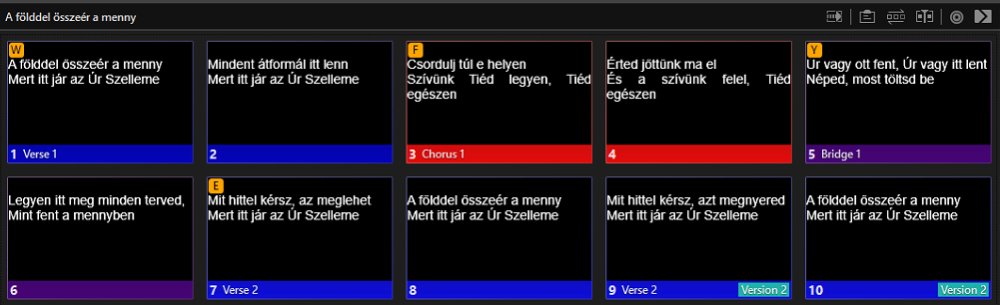
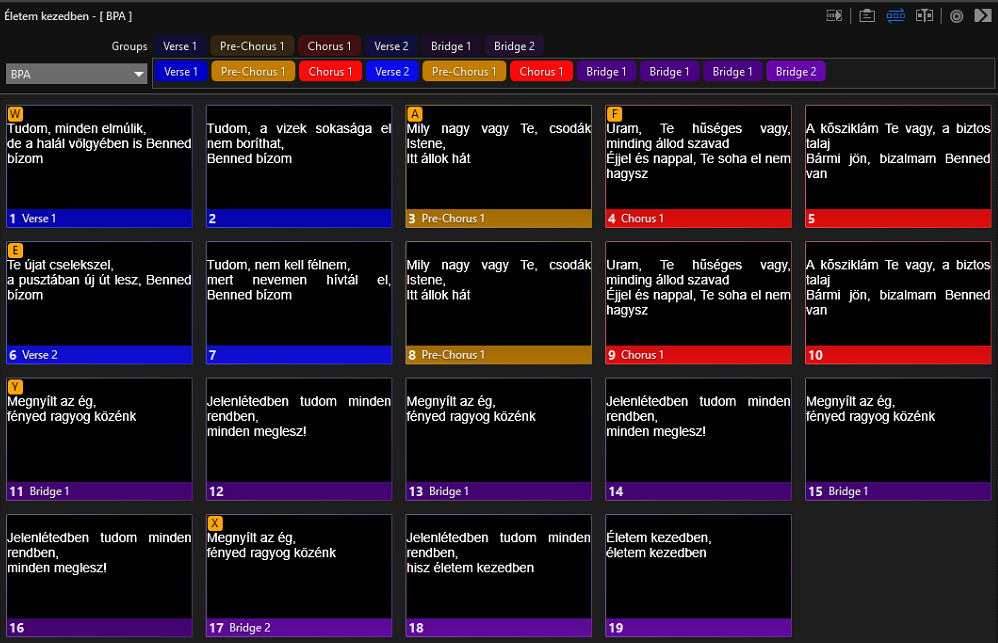

# A dalszövegek formátuma

Új dalszövegek beviteléhez elengedhetetlen, hogy bizonyos általános alapelveket lefektessünk, ami a szöveg formátumára vonatkozik. Ebbe beletartozik a dal címe, a helyesírás, a diákra tagolás, a nagybetűk használata, az írásjelek és a whitespace karakterek használata, és egyéb metainformáció, a szerkezeti egységek, ugyanazon dal több fordításának vagy változatának kezelése, a szerkezet, tehát az, hogy a szerkezeti részek milyen sorrendben követik egymást, és a gyakori dalkötések kezelése. Itt csak az elveket mutatom be, nem térek ki arra, hogy ezeket hogyan kell megvalósítani ProPresenter-ben, azt lásd a [ProPresenter használata](#TODO) részben.

## Dalcím (fájlnév)

A dalok címe az, ami a listában megjelenik, és kereséskor először a szemünk elé tárul, ezért nagyon fontos, hogy olyan címet adjunk neki, ami alapján könnyen beazonosítható. Ez gyakorlatilag magának a `.pro` fájlnak a neve, ami a dalszöveget tartalmazza. Ez a név lehetőleg a dal címe legyen, vagy egy sor, amiként a leggyakrabban szoktunk rá hivatkozni. Ha ebből még nem egyértelmű, melyik dalról van szó (mert például több ilyen dal is van, vagy ugyanannak a dalnak több fordítása), tovább írhatjuk a sort, amíg egyértelmű nem lesz, vagy zárójelben hozzáírhatunk még egy sort, amivel a refrén vagy az első verse kezdődik. Például: _„Hiszem (Véred megnyitja szemem)”_, és _„Hiszem (Istenünk örökkévaló)”_.

Ha a dalszövegben, amit a dal nevébe írnánk, ismételt szavak vannak, akkor az ismétlések elhagyhatók, elég egyszer leírni a szót. Például: _„Halleluja, halleluja, halleluja, szent az Úr”_ → _„Halleluja, szent az Úr”_.

A dal nevében az írásjelek közül csak a kötőjeleket és a vesszőket írjuk ki. Minden más írásjelet, speciális karaktert technikai okokból mellőzzünk. A dal nevét nagybetűvel kezdjük, továbbá nagybetűvel írjuk azokat a szavakat is, amit a dalszövegben is nagybetűvel írnánk (lásd [Nagybetűk](#nagybetűk) rész).

## Helyesírás

A dalszövegeket a magyar nyelv helyesírási szabályainak megfelelően írjuk le. Ehhez akkor is ragaszkodunk, ha a kottában, ahonnan másoljuk, másképp (hibásan) van. Kivételt képeznek a költői szabadságból, szándékosan helytelenül írt szavak (aminek az oka lehet például az, hogy a prozódia, vagy a rím kijöjjön). A helyesíráshoz természetesen az írásjelek helyesírása is hozzátartozik, ezt lásd az [Írásjelek](#írásjelek) részben.

## Tagolás

A dalszövegeket két sorba tördeljük törekedve arra, hogy a dal zenei szerkezetéhez igazodjunk. Például, ha egy refrén 6 soros és az zeneileg 3-3 sorra tagolódik, akkor nem 2-2-2 sorba tagoljuk, hanem 2-1-2-1 sorba.

Ha túl hosszú lenne a szöveg egy sorban, akkor azt a sort bontsuk két felé (szükség szerint új diát beszúrva). Megegyezés szerint a korlát, ami fölött törni kell, 40 karakter. Amikor egy dián az egyik sor jóval hosszabb, mint a másik, akkor nem feltétlenül szükséges új diát beiktatni. Helyette egy-két szót átvihetünk az első sor végéről a második elejére. Például _„A házasságtörő asszony”_ című dal második verse-ében a zenei tagolással az első sor túl hosszú lenne, de ha átviszünk néhány szót, akkor belefér:

> Mindenki magába szállva tudta, igazat mond, 
> s a földre dobta kövét

arrow_downward

> Mindenki magába szállva tudta, 
> igazat mond, s a földre dobta kövét

Ha már csak egy sor maradt egy diára egy zenei egység végén, és az viszonylag hosszú, akkor azt ketté törhetjük.

## Nagybetűk

Isten neveit és személyes névmásait nagy betűvel kezdjük. A teljesség igénye nélkül néhány példa: Isten, Jézus, Szent Szellem, Atya, Fiú, Úr, Örökkévaló, Pásztor, valamint Ő, Hozzá, Neki, Veled stb. A személyes névmások nagybetűsítése inkább szokás, mint szabály. Mint ilyen, nem nagy baj, ha nem írjuk nagybetűvel őket, különösen, ha jelzett, vagy képzett alakban van. Például az „övéiért” szót nyugodtan írhajuk kisbetűvel a következő szövegrészletben:

> Várom a napot, eljön az Úr 
> Az övéiért.

Alapesetben egy dián mindkét sort nagy betűvel kezdjük, kivéve, ha a két sor zeneileg egy egységbe tartozik, vagy ha a sortörésnél az előző tagmondatot folytatjuk (például, ha egy hosszú sor végét a következő sor elejére tördeltük, lásd a [Tagolás](#tagolás) részben), ilyenkor elég az elsőt.

## Írásjelek

Az írásjelek tekintetében is a magyar helyesírás szabályai szerint járunk el, illetve törekedünk rá, hogy az eredeti szöveg írásjeleit megtartsuk. Ez alól kivételt képeznek az alábbiak. A mondatzáró pontokat konvenció szerint sehol nem írjuk ki. Vesszőket a sor közepén mindig kiírjuk. A sor végén, amikor a vessző biztosan két tagmondatot választana el, kiírjuk, ha viszont akár két külön mondat is lehetne, akkor nem. Bizonytalan esetben ki lehet írni, de nem kötelező. A felkiáltó jeleket többnyire kitesszük, de nem visszük túlzásba (jellemzően ujjongást, kiáltást kifejező dalokban lehetne ez indokolt, de nem mutat jól, ha minden sor végén van felkiáltójel). A hármasponttal hasonló a helyzet, ezt sem visszük túlzásba. A többi írásjelet (zárójel, kötőjel, gondolatjel, idézőjel, kettőspont, pontosvessző, kérdőjel, aposztróf) minden esetben kiírjuk.

Előfordulnak kötőszavak, névelők, amelyeket nem mindig éneklünk ki, ezeket zárójelbe tehetjük, például: _„(Hogy) az imádód lehessek”_. Megjegyzendő az is, hogy amikor a sor elején van a zárójeles szó, akkor az lesz nagybetűs, és az utána következő már nem. Zárójelet használhatunk továbbá akkor is, amikor a vezetőének után a kórus megismétli a sort, például: _„Az Úr van itt, (az Úr van itt)”_.

Azoknál a szavaknál, amelyekből elhagyunk betűket, az elhagyás helyét aposztróffal (más szóval hiányjellel) jelöljük, például: _„Megtehette volna, hogy ott hagy lenn a porba’”_. Sok esetben viszont, ahol eredetileg indokolt lett volna az aposztróf használata, a rövid alak már állandósult a magyar nyelvben, ezért nem kell kitenni az aposztrófot. Ilyenek a vonatkozó névmások, amelyek elejéről elhagyjuk az _a_-t, például _ki_, _mi_, _hol_ stb.; az _olyan_, _ilyen_, és _milyen_ szavakból képzett _oly_, _ily_ és _mily_ szavak; az _s_ kötőszó; a _hiszen_-ből képzett _hisz_ és a _majdnem_-ből képzett _majd_ szavak.

Néhány speciális írásjelnél figyelni kell arra, hogy a pontos karaktert írjuk le, ne rá hasonlító, de helytelen változatait. Ezek nem szerepelnek a billentyűzeten, ezért Alt-kóddal kell beírni őket, ehhez a bal Alt-ot nyomva tartva kell egy számsorozatot beírni a számpadon (számpad nélküli billentyűzeten az Fn-t is nyomva kell tartani, és a betűk között kell megkeresni a számpadot). Ha ezt nem tesszük meg, nem tragédia, de a felirat minősége sokkal jobb lesz, ha igen.

| Írásjel     | Helytelen karakterek    | Helyes karakterek                                                                   | Alt kód               |
| ----------- | ----------------------- | ----------------------------------------------------------------------------------- | --------------------- |
| Hármaspont  | Három pont              | Hármaspont (…)                                                                      | Alt+0133              |
| Idézőjel    | Bármilyen más idézőjel  | Idézet elején alsó 9-es állású dupla idézőjel („), a végén ugyanilyen felső (”) | Alt+0132 Alt+0148 |
| Gondolatjel | Kötőjel, Em-dash        | En-dash (–)                                                                         | Alt+0150              |
| Aposztróf   | Bármilyen más aposztróf | Felső 9-es állású szimpla aposztróf (’)                                             | Alt+0146              |

## Whitespace karakterek

Fontos, hogy az első sor előtt és az utolsó sor után ne legyen extra soremelés karakter, valamint a sorok elején és végén ne legyenek extra szóközök (sem tabok és egyéb whitespace). A szavak között csak egyetlen szóköz legyen, a sorok között pedig csak egyetlen soremelés. Új dal beírásánál, főleg, ha meglévő szövegből másoljuk, becsúszhatnak ilyen fölösleges karakterek, ezekre figyeljünk, töröljük ki, különben a kivetített szöveg eltolódik, ami zavaró.

## Szerkezeti egységek

A dalok szerkezete leggyakrabban az alábbi szerkezeti egységeket tartalmazza: Intro, Verse, Pre-Chorus, Chorus, Bridge, Coda, Interlude, és Post-Chorus. Ritkább esetben előfordulhatnak továbbiak is, Vamp az Intro helyett, Ending/Outro a Coda helyett, Instrumental/Solo az Interlude helyett, valamint Turnaround a Post-Chorus helyett. Bár ezeket is lehet használni, alapvetően a fent felsoroltak a preferáltak.

Azokat a részeket, amelyekből jellemzően több van (értsd: ugyanolyan szerkezeti rész más szöveggel), 1-től kezdve számozhatjuk, például Verse 1, Verse 2 stb. Számozni a következőket lehet: Verse, Pre-Chorus, Chorus és Bridge, a többiből mindig legfeljebb egy van egy dalban.

A szerkezeti egységeket ProPresenter-ben group-oknak hívják. Átláthatóság céljából színkódoltam őket azokkal a színekkel, amelyekkel itt is színezve vannak. A group-okról bővebben [itt](#TODO).

A ProPresenter-ben gyorsbillentyűket is rendeltem az egyes szerkezeti egységekhez. A gyorsbillentyűk használatáról, és beállításáról bővebben [itt](#TODO).

A szerkezeti egységekből össze lehet rakni tetszőleges szerkezetet, ahol mi választjuk meg, hogy melyik egységből mennyit és milyen sorrendben rakunk egymás után. Erről bővebben a [Szerkezet](#szerkezet) részben lehet olvasni.

## Több fordítás, több változat

Amikor ugyanazon dalnak több fordítása vagy változata is van, két esetet különböztetünk meg. Az első esetben a két változatban a dalszöveg teljes egésze különbözik. Ekkor a két dalszöveget két külön diasorba (fájlba) tesszük, és a címe is eltérő lesz, igazodik a megfelelő dalszöveghez. Erre jó példa a _Láncom lehullt_ című dal, itt a két fájl címe _Láncom lehullt (szabad vagyok)_ és _Láncom lehullt (lelkem szabad)_.

A második esetben a szövegnek csak egy része más a két változatban, ekkor nem rakjuk két külön fájlba a két változatot, viszont ahol a szöveg eltér, ott az egész befoglaló szerkezeti egységet kétszer rakjuk bele a diasorba, a két változatnak megfelelően, és megjelöljük a másodikat a Version 2 címkével. A címkékről vagy label-ökről bővebben [itt](#TODO) olvashatunk. Természetesen három vagy több változat esetén hasonlóan teszünk, és a Version 3 stb. címkéket használjuk. A címkével meg kell jelölni a részben az összes diát, ezt úgy tehetjük meg, hogy kijelöljük az érintett diákat és utána állítjuk be a címkét. Például _A földdel összeér a Menny_ című dalban a második verse-ben egy másik változatban _„azt megnyered”_ van _„az meglehet”_ helyett:

Érdemes megemlíteni egy harmadik, speciális esetet is, amikor ugyan az egész szöveg különbözik, viszont csak egyetlen részből áll az egész dal, például az _Árassz el_ (_Árassz el, árassz el…_ / _Árassz el Szellemeddel…_ / _Áraszd ránk Szellemed…_).

## Szerkezet

A dalok szerkezete, vagyis az, hogy milyen sorrendben követik egymást a szerkezeti egységek, nem formai követelmény a szó szoros értelmében. Mégis a vetítésnél néha hasznos lehet, ha egy bonyolultabb dalnál a szerkezetet előre tudjuk. A ProPresenter lehetővé teszi, hogy a meglévő szerkezeti egységekből összeállítsunk egy (vagy akár több) szerkezetet (arrangement), ahol egy-egy szerkezeti egységet több példányban is beilleszthetünk, vagy akár teljesen ki is hagyhatunk. Ha kiválasztjuk a szerkezetet, amit beállítottunk, akkor olyan sorrendben listázza ki a diákat, ahogy azt összeraktuk.

Az arrangement-ek használata régebben nem jelentett nagy előnyt, és azt is csak a kivetítő számára. Most viszont, hogy van dedikált [stage monitor kimenetünk](/Eszközök?id=decklink-duo-2), nagy jelentőséget nyert. Itt ugyanis megjeleníthetjük a diasorban a következő dia tartalmát, tehát a következő két sort a dalszövegből. Ha nem használunk arrangement-et, akkor értelemszerűen ez a szöveg nem mindig a ténylegesen következő sorokat fogja mutatni a szerkezeti egységek végén. Tehát ha lehet, használjunk arrangement-eket, de nem létszükséglet. Az arrangement funkció használatáról bővebben [itt](#TODO).

Viszont azért, hogy arrangement nélkül is jól használható legyen a diasor, a dal szövegét úgy kell sorrendbe rakni, hogy az a szokásos sorrendnek megfeleljen, tehát a szerkezeti egységek első előfordulása szerint legyenek sorrendbe rakva. Ezt jellemzően könnyű kivitelezni, hiszen maguk a kották vagy az internetes dalszöveg oldalak is ilyen módon vannak elkészítve.

### Ismétlések egy szerkezeti egységen belül

Olyan dalok is vannak, ahol egy vagy két sort mindig megismételnek, mielőtt továbbmennek. Azért, hogy ne kelljen kétszer vagy többször leírni az adott sort vagy sorokat, használhatjuk a Repeat 2x, Repeat 3x stb. címkéket, vagy ha nincs megkötve, hogy hányszor ismétlik, akkor egyszerűen a Repeat címkét. Ez segítség a vetítőnek is, de az énekeseknek is, hiszen a stage monitoron is meg lehet jeleníteni a címkéket.

Fontos megemlíteni, hogy ez a címke mindig egy diára vonatkozik. Ha több diát ismételnénk, de nem a teljes szerkezeti részt, akkor ott bontsuk ketté az adott részt és az arrangement-ben tegyük be többször az ismételt részt. Például az _Életem kezedben_ című dalban a Bridge első két diája ismétlődne háromszor, így ketté osztottam Bridge 1-re, és Bridge 2-re, és az arrangement-ben a Bridge 1-et háromszor húztam be.

## Gyakori dalkötések

Vannak olyan dalpárok, amelyeket gyakran egymáshoz fűzve énekelnek, például _„Jézus, életem forrása”_ → _„Egyedül csak Te vagy Kősziklám”_, vagy _„Halleluja, Jézus Krisztus él”_ → _„Ünnepeld”_. Ilyenkor a kötött dal első szerkezeti egységét, ami az első dal után következik, hozzáfűzzük az első dal végéhez. A plusz részre rárakjuk a Next Song címkét. Így a kecske is jóllakik és a káposzta is megmarad: az első dal végén már ki is rakhatjuk a következő elejét, és marad idő megtalálni a következő dalt, de még sincs olyan sok szöveg egy diasorban, mintha a teljes második dalt betoldottuk volna.
