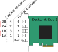
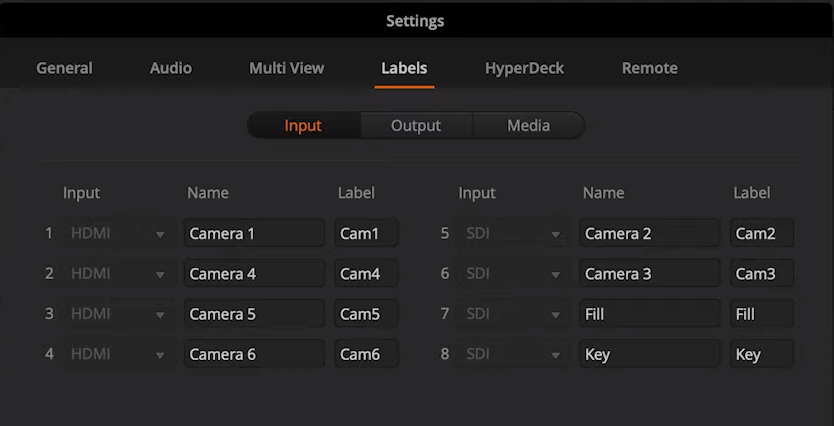
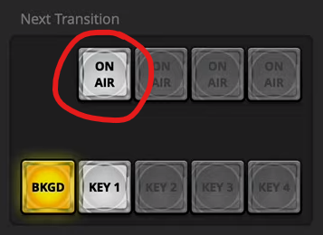

# Eszközök

## Számítógépek

A gyülekezetnek két számítógépe van kivetítésre, egy laptop és egy asztali pc. Ebben az útmutatóban ha másképp nincs említve a laptop kifejezés erre a laptopra, a számítógép vagy gép kifejezés pedig erre a pc-re vonatkozik. A fontosabb adatokat az alábbi táblázat foglalja össze.

| Név                 | Típus             | CPU        |  RAM |             Tárhely | Kimenetek száma[\[1\]](#f-outputs) | Csatlakozók                                               |
| ------------------- | ----------------- | ---------- | ---: | ------------------: | ------------------------------------------------------------: | --------------------------------------------------------- |
| KIVETITO-LAPTOP (?) | ASUS X556U laptop | i5, 2.3GHz |  8GB | 250GB SSD + 1TB HDD |                                                             1 | VGA vagy HDMI                                             |
| KIVETITO-PC (?)     | Asztali PC        | i7, 3GHz   | 16GB |           500GB SSD |                                                         4(+1) | SDIx4 (DeckLink); DisplayPort, HDMI, DVI-I (GTX 1650) |

### DeckLink Duo 2

Az asztali pc-be be van építve egy DeckLink Duo 2 kártya. Erről azt kell tudni, hogy négy darab SDI csatlakozója van, mind a négyet lehet bemenetként és kimenetként is használni. Ne tévesszen meg senkit, hogy 5 csatlakozó van rajta, az ötödik csak a videókép-szinkronizálásra szolgál (Reference in), és alapesetben nem használjuk.

A fizikai csatlakozók és a logikai videócsatornák máshogyan vannak számozva, erre figyelni kell (lásd az ábrát). Az első kettő csatlakozó (vagyis az 1. és a 3. csatorna), illetve a harmadik és a negyedik (vagyis a 2. és a 4. csatorna) összepárosítható páros csatornának.

!> Jelen konfiguráció szerint a csatlakozókat a következő kiosztásban használjuk.

| Logikai csatorna | Fizikai csatlakozó | Felhasználás                   |
| ---------------- | ------------------ | ------------------------------ |
| 4                | 4                  | Projektor (terem)              |
| 2                | 3                  | Súgó (stage) monitor           |
| 1B               | 2                  | Broadcast (fill)               |
| 1A               | 1                  | Broadcast alpha csatorna (key) |

A párosításokat, illetve felbontás és frissítési frekvenciákat a **Blackmagic Desktop Video** programban tudjuk beállítani.

TODO képernyőkép.

A kimenetek beállításáról ProPresenter-ben [itt](#TODO) lehet olvasni.

## Videós felszerelés

### ATEM 1 M/E Production Studio 4K

Ez a gyülekezet videóvágó pultja. Ide fut be a négy kimenetünk közül három, a broadcast és az alfája, valamint a projektor. A stage monitor azért nem, mert oda egyelőre nem adunk kamera képet, így az mehet kötvetlenül a számítógépből a monitorba. A pulttal össze van kötve egy Mac, amin fut az **ATEM Switcher** program, amivel a pultot lehet vezérelni.

!> Jelenleg a csatlakozók kiosztása a következő (csak amelyek a kivetítés szempontjából érdekesek, a kamerákat nem sorolom fel):

| Csatorna                  | ATEM csatlakozó |
| ------------------------- | --------------- |
| Projektor (terem) bemenet | SDI IN 7        |
| Broadcast (fill)          | SDI IN 1        |
| Broadcast (key)           | SDI IN 8        |
| Projektor (terem) kimenet | SDI OUT 1       |

#### Broadcast fill és key

##### Labels

A broadcast kimenet felkonfigurálásához először nevezzük el a programban a megfelelő csatornákat például _Key_-nek és _Fill_-nek. Ezt a beállítások _Labels_ fülén lehet megtenni. Például, ha a 7-es SDI bemenetre dugtuk a fill-t és a 8-asra a key-t, akkor ez így fog kinézni:

Ne felejtsük el az Input-ot sem megadni attól függően, hogy HDMI-n vagy SDI-n jön be a jel.

Ezután a _Switcher_ ablakban a jobb oldali panelen a Palettes fülön válasszük ki az _Upstream Key 1_ elemet, és azon belül a _Luma_ fület. Állítsuk be a _Fill Source_-t és a _Key Source_-t, majd ha nem lenne bejelölve, jelöljük be a _Pre Multiplied Key_ kapcsolót.

Végül továbbra is a _Switcher_ ablakban a _Next Transition_ szekcióban be kell kapcsolni az első _ON AIR_ kapcsolót.

#### Projektor kimenet

A pult panelén a jobb oldalon lévő három gombbal választjuk ki, hogy melyik kimenetet szeretnénk állítani, és a bal oldalon, hogy erre a kimenetre mit küldjünk. Tegyük fel, hogy a hármas SDI kimeneten küldjük el a projektorhoz a képet, a vetítős gépből pedig a hatos bemeneten érkezik a projektorra küldött kép. Válasszuk ki a **3**-as kimenetet, és utána ha a ProPresenter képét szeretnénk a projektorra küldeni, akkor a **6**-os bemenetet, ha pedig a vágott kameraképet, akkor a **PGM** (program) gombot nyomjuk meg.

### Átalakítók, kábelek, transzmitterek

A gyülekezet rendelkezik (többféle hosszúságú) SDI kábelekkel, SDI-HDMI átalakítókkal, HDMI kábelekkel, és wireless video átvivőkkel. A megfelelő konfigurációról, hogy hova milyen kábelt, és milyen átalakítót kell bekötni, mindig konzultájl a videós kollégákkal.

---

1 Azon kimenetek száma, amiket a kivetítésre lehet használni, vagyis ebbe a számítógép saját monitora nem számít bele. [Vissza](#fb-outputs)
