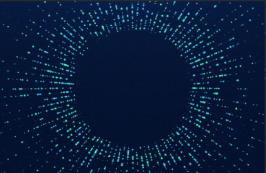

# Könyvtárak

Alább látható a gépen található, a kivetítés szempontjából lényeges mappaszerkezet.

## Google Drive

A BPA Kivetítés teljes Drive-ját a Google Backup and Sync alkalmazással szinkronizáltuk a `C:/Users/bpaki/Google Drive` mappába. Ez azt jelenti, hogy bármilyen módosítás a felhőben letöltődik és érvényesül a gépen is, és fordítva (persze ehhez szükséges internetkapcsolat).[\[1\]](#f-dropbox)

### BPApresentation

A Drive-ban található egy `BPApresentation` mappa, ami az aktuális vetítős anyagokat, valamint a ProPresenter összes dokumentumát tartalmazza.[\[2\]](#f-drive-folders) Ezt megosztottuk a bpa-presentation-team Google csoporttal, így aki ebben benne van, az Google Drive segítségével elérheti és szerkesztheti. Ez kifejezetten hasznos akkor, amikor megkapjuk a kivetítési anyagokat egy eseményhez, fel akarjuk másolni a vetítős gépre, de az nincs nálunk. Ilyenkor ezeket feltölthetjük a Drive-ba, és legközelebb, amikor a vetítős gépet bekapcsoljuk (és van internete), automatikusan letöltődnek.

#### ProPresenter

Itt találhatóak a ProPresenter saját fájljai, amik legtöbb beállítást és dokumentumot tartalmazzák, amit a programban beállítottunk, illetve létrehoztunk. Célszerűen ezeket is szinkronizáljuk, hogy könnyű legyen megosztani. Sajnos nem minden adat van itt, vannak még a programnak fájljai az [AppData/Roaming/RenewedVision/ProPresenter](#/Könyvtárak?id=archívum) mappában is.

!> Fontos, hogy ezt a mappát a gépen lévő ProPresenter használja, és ha kívülről írjuk, egy másik gépen futó ProPresenter-ből, az bugokat okozhat. Nem tiszta még, hogy pontosan mi okozza ezeket a hibákat, de egyelőre maradjunk annyiban, hogy ennek a mappának a tartalmát csak a gépen futó ProPresenterből írjuk, és kívülről csak olvassuk. Ha prezentációkat, listákat, vagy beállításokat kell importálni, akkor azt is a programból végezzük inkább, mint fájlkezelőből (erről részletesen az [importálásnál](#TODO)).

A ProPresenter mappa az alábbi almappákat tartalmazza.

| Mappa         | Tartalom                                                                                                                                                                                                                                                                     |
| ------------- | ---------------------------------------------------------------------------------------------------------------------------------------------------------------------------------------------------------------------------------------------------------------------------- |
| Configuration | Különféle konfigurációs adatok, mint például az időzítők és órák beállításai, szerkezeti egységek (csoportok), címkék, üzenetek, a stage display elrendezések és a felhasználói felület elrendezése.                                                                         |
| Libraries     | A prezentációkat tartalmazó könyvtárak.                                                                                                                                                                                                                                      |
| Media         | A ProPresenter-ben cache-elt képek és videók. Itt ne tároljunk fontos dokumentumokat, helyette az arra kijelölt mappákat használjuk (aktuális dokumentumok, archív dokumentumok, hátterek, visszaszámlálók).                                                                 |
| Playlists     | A prezentációs, a média és az audió lejátszási listák. Innen a listák külön-külön nem megoszthatóak, mint régen, mert most már egyetlen (illetve kategóriánként egy) fájlba vannak összesűrítve. Helyette a programból lehet ezt megtenni az [exportálás](#TODO) funkcióval. |
| Presets       | Elmentett képátmenetek és effektusok.                                                                                                                                                                                                                                        |
| Themes        | Témák (korábbi néven sablonok).                                                                                                                                                                                                                                              |

##### Libraries

A könyvtár két dolgot is jelent, a programbeli könyvtárakat és a fájlrendszerbelieket. Szerencsére a ProPresenter-es könyvtáraknak megvan a fájlrendszerbeli könyvtár megfelelőjük. Ezekben találhatóak a prezentációk, amelyeknek `.pro` a kiterjesztésük (a 6-os verzióban még `.pro6` volt). A prezentációk létrehozásáról és szerkesztéséről bővebben [itt](#TODO).

A **Songs** könyvtárban találhatóak a BPA istentiszteletein és egyéb alkalmain (KIT, ifi, ApCsel, dicsőítő alkalmak) énekelt dalok prezentációi. Az a cél, hogy itt meglegyen az összes dal, ami ezeken az alkalmakon előfordulhat. Mivel ezt gyakran használjuk, ezért elvárjuk, hogy megfelelő formátumban benne legyenek a dalok. Ez azt jelenti, hogy mind a meglévő dalok szerkesztésekor, mind új dalok bevitelekor szem előtt kell tartani a [dalszövegekre vonatkozó irányelveket](#TODO).

A **Slideshows** könyvtárban találhatóak az igehirdetések, előadások, bizonyságok prezentációi, valamint a gyülekező és hirdetés slideshow-k, vagyis minden olyan prezentáció, ami nem dalszöveg. A lejárt prezentációkat [archiváljuk](#archívum), vagy frissítsük a következő alkalomra, hogy mindig csak az aktuális dolgok szerepeljenek itt.

Ezen kívül külsős eseményekhez (Dics-suli, Felház, kisebb alkalmak) érdemes létrehozni új könyvtárat, hogy egy helyen legyenek. Ezt meg lehet tenni a programból is és a fájlkezelőből is, ez utóbbi esetben viszont újra kell indítani a programot, hogy a változás látsszon.

##### Themes

Itt találhatók a témák vagy korábbi nevén sablonok (template). Ha meg akarsz osztani egy témát, vagy kaptál egy témát, amit akarsz használni a programban, akkor itt találod, illetve ide kell bemásolni. Egy téma csoporthoz egy mappa tartozik a téma nevével. A témacsoporton belül a témák külön nem kezelhetőek a fájlrendszerben, csak ProPresenter-ben (ez érthető, hiszen egy témacsoport gyakorlatilag egy diasor és az egyes témák a diák). A megosztás másik módja az [exportálás](#TODO). A témákról bővebben [itt](#TODO).

#### Aktuális dokumentumok

Itt találhatók az aktuális képek, videók, pptx prezentációk és egyebek. Minden, ami éppen aktuális és nem ProPresenter-es fájl, az itt van és csak itt. A jobb átláthatóság kedvéért létrehozhatsz ezen belül almappát egy-egy alkalomhoz. A ProPresenter-ben beállítottunk egy Smart Playlist-et erre a mappára, tehát minden változtatás a fájlkezelőben rögtön megjelenik a programban is és fordítva (a Smart Playlist-ekről bővebben itt TODO). Azt is megoldottuk, hogy a bpakivetites@gmail.com címre érkező csatolmányok is automatikusan bekerüljenek ide. Fontos, hogy ami biztosan elavult, azt helyezd át az archívumba, hogy itt mindig friss információ legyen.

## Preferences

A program beállításait tartalmazza, ahogyan a felhasználói felület kinéz, a kimeneti beállítások, a Biblia olvasó beállításai, import beállítások, és még sok más. Ezt is szinkronizáltuk a Google Drive-ba, így ez is elérhető távolról.

!> Erre is ugyanaz érvényes, ami a ProPresenter mappára, ne írjuk a gépen futó ProPresenter-en kívül.

## Background Pictures és Videos

Itt tároljuk a háttereket, amiket a dalszövegek, hirdetések, igeversek stb. alá be tudunk tenni. Külön mappa van az álló (Background Pictures) és a mozgó (Background Videos) háttereknek. Ide tehetsz be magad is háttereket, de tartsd szem előtt az alábbi irányelveket.

1. Jó minőségű legyen, legalább **720p** de inkább **1080p** felbontású.
2. Lehetőleg **16:9** arányú legyen, hiszen a kimenetek is általában ilyenek.
3. Szép legyen, kivetítésre alkalmas, ne legyen túl világos, látszódjon rajta a fehér szöveg.
4. A kereshetőség érdekében a nevében szerepeljenek a jellemzői. Néhány ilyen jellemző a teljesség igénye nélkül, de bőségesen adva ötletet:

   - Tempó (videó esetén): _fast, semi-fast, slow, still_
   - Szín: _dark, bright/light, rainbow/color, black, white, gray/grey, red, orange, yellow, green, cyan, blue, purple, brown, violet, lime, aqua, teal, gold, b&w_
   - Középpont helye, alakzatok orientációja: _top, bottom, left, right, center, horizontal, vertical, diagonal, grid, skew, radial, tunnel_
   - Alakzatok, objektumok: _circle, square, rectangle, diamond, triangle, hexagon, lines, stripes, chevron, curves, dots, stars, particles, lights, beams/rays_
   - Anyagok, tárgyak: _texture, fabric, wood, metal, glass, glitter, water, nature, rain, snow, fire, flowers, city, mountain, sky, clouds, sea, book, bible, stb_
   - Hatások: _bokeh, blurry, kaleido, mirror, timelapse, slowmo_
   - Mozgások, átmenetek (videó esetén): _moving inwards, outwards, forward, left, right, up, down, sideways, ascending, descending, falling, rotating, flow, flash, fade, swirl, twist, pulse, glow, wave, sparkle, glisten_

   Példa:

   

   _„slow dark blue dots lines center radial moving outwards.mov”_

5. A mozgó háttér legyen loop-olt, tehát ne legyen törés a vége és az eleje között, ha ismételten játsszuk le. Nem loop-olt videókhoz használható a ProPresenter Soft Loop funkciója, de szebb, ha már alapból loop-olt.
6. A képek `jpg` vagy `png` formátumban, a videók `mp4` vagy `mov` formátumban legyenek. A ProPresenter egyébként ennél sokkal több formátumot is képes kezelni, de ezek a legelterjedtebbek, így ezeket ajánlom.

## Archívum

Az archívumban tároljuk azokat a kivetítendőket, amelyek már nem aktuálisak, és kevés esély van rá, hogy valaha kelleni fognak még. Mégis a biztonság kedvéért, és hogy később vissza lehessen keresni, érdemes mindent elmenteni. Ezen belül ugyanúgy van egy mappa (ProPresenter) a ProPresenter fájljainak, egy másik (Archív dokumentumok) a prezentációknak és egyéb anyagoknak, valamint egy-egy mappa a régi vetítős programok fájljainak (ProPresenter6 fájlok és EasyWorship2009 fájlok).

### Archív dokumentumok

Az Archív dokumentumok mappában az alábbi rendszer szerint tároljuk a fájlokat. Egy-egy nagyobb eseménynek vagy szervezetnek lehet külön mappája, ilyenek például: BPA, BPA ifi, BPA gyerekszolgálat, Dics-suli, KIT, Tűz konferencia stb. Ezeken belül lehetnek mappák az egyes eseményekhez, vagy maguk a kivetítendő fájlok. A fájlokat érdemes úgy elnevezni, hogy a neveik dátummal kezdődjenek, így könnyen visszakereshetőek. Események, plakátok esetén ez az adott esemény dátuma (ha több dátum is van, vagy egy több napos időszak, akkor az első nap), tanítások, énekek esetén pedig az a nap, amelyiken elhangzott. Ha utólag kell ezeket meghatározni, érdemes a módosítás dátumát megfigyelni.

---

1 Régen Dropbox-ot használtunk, de annak az ingyenes verziója csak 2 GB tárhelyet tett elérhetővé, míg a Google-nél ez 15 GB. A Backup and Sync működése egyébként teljesen azonos a Dropbox-éval. [Vissza](#fb-dropbox)

2 Igazából a `BPApresentation` mappán kívül nincs semmi a Drive-ban. Azért van ez így, mert a teljes Drive-ot nem lehet megosztani, csak mappákat és fájlokat, és így csak egyetlen mappát kell megosztani. [Vissza](#fb-drive-folders)
