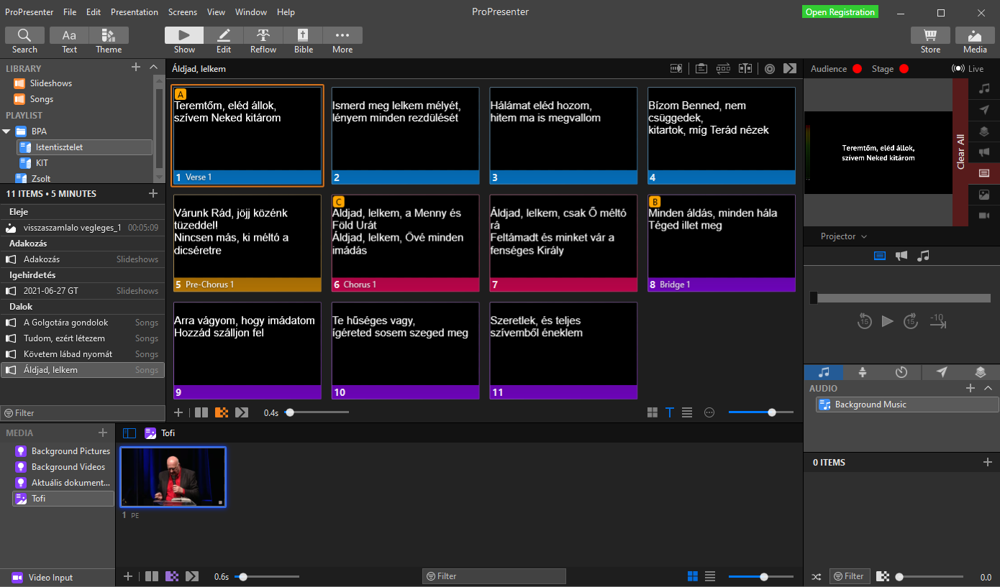
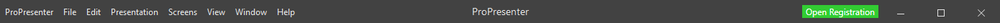
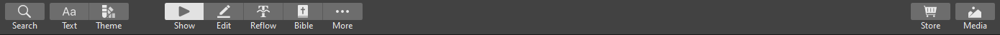
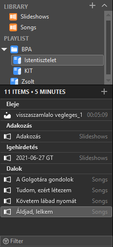

# Felhasználói felület

A felhasználói felület az alábbi részekből áll. Klikkelj egy részre, hogy elnavigálj a leírásához.

    
    
    
    
    
    
    
    

## Menü

Mint általában az asztali alkalmazások, ez is rendelkezik menüvel. Viszont ahelyett, hogy a menüpontokon végigmennék, a különböző funkciók részletezésénél fogok kitérni rá, hogy az hol található a menüben.

Jobb oldalt látható egy színes gomb. Ez jelöli a regisztrációval és a frissítésekkel kapcsolatos teendőket. - Open registration: nincs regisztrálva a program, be kell írni a [regisztrációs nevet és licensz kódot](Fiókok?id=propresenter).

## Eszköztár

Alább olvasható a gombok listája. Kattints a linkre, hogy elnavigálj az adott funkció részletesebb leírásához.

- [**Search**](#TODO). Keresés a prezentációkban.

- Gyorsformázás. Az aktuálisan a Dia panelen lévő diasor kiválasztott elemein, vagy ha nincs kiválasztva egy sem, akkor az egészen végez módosításokat. Kiválasztani diákat egyesével a Ctrl + kattintással, intervallumot pedig a Ctrl + Shift + kattintással lehet (a sima kattintás kivetíti a diát).
  - [**Text**](#TODO). Ezzel a szöveg egy-egy tulajdonságát lehet módosítani: méret, betűtípus, betűstílus, igazítás, körvonal, árnyék.
  - [**Theme**](#TODO). Az előre elkészített témákat lehet ráhúzni a diákra.
- Nézetek, szerkesztők. Itt lehet kiválasztani, hogy mi legyen a Dia panelen, illetve esetekben az egész ablakban.
  - [**Show**](#TODO). Kivetítő mód, itt tudjuk a dalokat és prezentációkat kivetíteni.
  - [**Edit**](#TODO). Részletes szerkesztő, ezzel a diasor minden részletét és beállítását teljes mértékben szerkeszteni tudjuk.
  - [**Reflow**](#TODO). A dalszöveg szerkesztésére használható, a formázásra nem. Ezzel egyszerűen lehet a szöveget szerkeszteni, új diát beszúrni, egy diát kétfelé bontani, két diát összevonni.
  - [**Bible**](#TODO). Bibliavers kivetítésére használjuk.
  - **⋯** További szerkesztők.
    - [**Stage Editor**](#TODO). A stage avagy súgómonitor témáit lehet ezzel szerkeszteni.
    - [**Theme Editor**](#TODO). A témákat lehet vele szerkeszteni, amiket a prezentációk diáira lehet alkalmazni.
    - **CCLI Editor**. A CCLI licenszt megjelenítő diát lehet vele szerkeszteni. A mi szempontunkból lényegtelen.
    - **Props Editor**. A props diákat lehet vele szerkeszteni. Ez arra jó, ha valamit a diák fölötti rétegben meg akarunk jeleníteni. Jelenleg nem igazán hasznájuk.
    - **Mask editor**. A maszkot lehet vele szerkeszteni, ami elfedi az összes réteget. Akkor érdemes használni, hogyha a vetítő nagyobb területre vetítene, mint a vászon, vagy fal. Jelenleg ezt sem használjuk.
- **Store**. Itt lehet fizetős média tartalmat (hátterek, visszaszámláló videók, stb.) vásárolni.
- **Media**. Kapcsoló a média panel megjelenítésére/elrejtésére.

## Könyvtárak és lejátszási listák

A panel egy felső és egy alsó részre tagolódik. A felső részen láthatóak a könyvtárak és lejátszási listák, ezekre kattintva pedig az alsó részen megjelenik annak a tartalma. Ha az alsó részen kattintunk egy elemre (diasor, média vagy fejléc), akkor az megjelenik a Dia panelen. Ha be van kapcsolva a Continuous Playlist (View menü), akkor a lejátszási listák esetében nem csak a kiválasztott elem jelenik meg, hanem folytonosan az összes, és görgetéssel tudunk navigálni.
