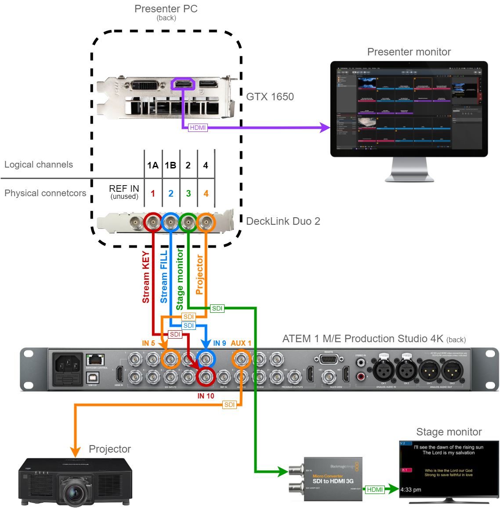
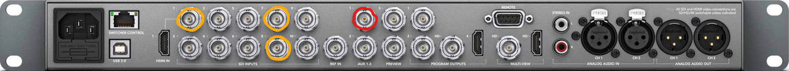
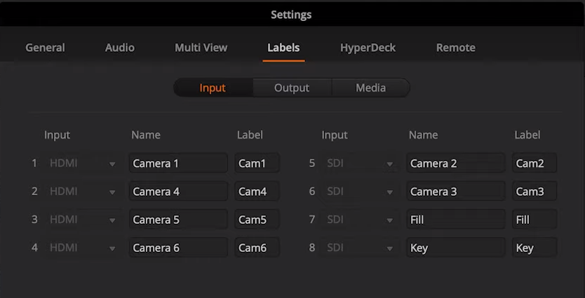
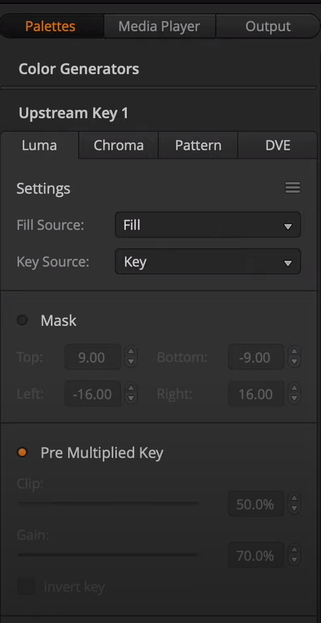
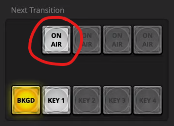
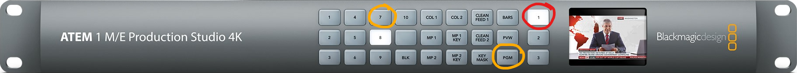
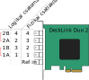

# A rendszer felépítése

A kivetítős rendszert jelenleg ({docsify-updated}) az alábbi összeszerelésben használjuk. Részletek lejjebb.

## A számítógép előkészítése

A gyülekezetnek a kivetítésre egy asztali [számítógép](#számítógép) áll rendelkezésére. Ebbe be van építve egy [DeckLink Duo 2](#blackmagic-decklink-duo-2) kártya, amelyből a videó kimeneteinket küldjük. Ezen kívül van egy Nvidia GTX 1650 videókártya is, amelyből a fő monitor videójele megy ki.

A kimenetek megfelelő működéséhez fel kell konfigurálni azokat a számítógépen. A DeckLink kártya kimeneteit a saját programjában tudjuk beállítani, lásd [itt](#blackmagic-desktop-video). Ezeket a kimeneteket csak a ProPresenter használja, a Windows-on nem fog megjelenni kijelzőként. A Windows kijelzőit [így]() tudjuk beállítani.

A ProPresenter-ben is be kell állítani a kimeneteket, ehhez segítséget [itt](#TODO) lehet találni.

## Az ATEM előkészítése

A stream videó vágására egy ATEM 1 M/E Production Studio 4K típusú switcher-t használunk. Ide fut be a négy kimenetünk közül három, a stream felirat és az alfája, valamint a projektor. A stage monitor azért nem, mert oda (egyelőre) nem adunk kamera képet, így azt küldhetjük közvetlenül a számítógépből. A switcher-rel össze van kötve egy Mac, ezen fut egy **ATEM Switcher** nevű program, amivel a switcher-t lehet vezérelni.

#### Stream fill és key

A jelenlegi konfigurációban alfa kulcsolást használunk a stream felirathoz (a kulcsolásról [itt](#kulcsolás)).

##### Labels

A stream felirat felkonfigurálásához először nevezzük el a Switcher-ben a megfelelő csatornákat például _Key_-nek és _Fill_-nek. Ezt a beállítások _Labels_ fülén lehet megtenni. Például, ha a 7-es SDI bemenetre dugtuk a fill-t és a 8-asra a key-t, akkor ez így fog kinézni:

Ne felejtsük el az Input-ot sem megadni attól függően, hogy HDMI-n vagy SDI-n jön be a jel.

##### Key

Ezután a _Switcher_ ablakban a jobb oldali panelen a Palettes fülön válasszük ki az _Upstream Key 1_ elemet, és azon belül a _Luma_ fület. Állítsuk be a _Fill Source_-t és a _Key Source_-t, majd ha nem lenne bejelölve, jelöljük be a _Pre Multiplied Key_ kapcsolót.

##### On Air

Végül továbbra is a _Switcher_ ablakban a _Next Transition_ szekcióban be kell kapcsolni az első _ON AIR_ kapcsolót. (Azért az elsőt, mert az tartozik az Upstream Key 1-hez.)

#### Projektor kimenet

A switcher panelén a jobb oldalon lévő három gombbal választjuk ki, hogy melyik AUX kimenetet szeretnénk állítani, és a bal oldalon, hogy erre a kimenetre mit küldjünk. A fenti ábrának megfelelően az egyes SDI kimeneten (AUX 1) küldjük el a projektorhoz a képet, a vetítős gépből pedig az ötös bemeneten (IN 5) érkezik a projektorra küldött kép. Válasszuk ki az **1**-es kimenetet, és utána ha a ProPresenter képét szeretnénk a projektorra küldeni, akkor az **5**-ös bemenetet, ha pedig a vágott kameraképet, akkor a **PGM** (program) gombot nyomjuk meg.

---

# Függelék

Ez a rész azoknak szól, akik egy kicsit mélyebben szeretnék megismerni az eszközöket és használatukat.

## Eszközök

### Számítógép

A számítógépünk főbb paraméterei a következők.

| Hardver     | Típus                                                                                                                                           |
| ----------- | ----------------------------------------------------------------------------------------------------------------------------------------------- |
| CPU         | [Intel i7-9700F](https://ark.intel.com/content/www/us/en/ark/products/193738/intel-core-i79700f-processor-12m-cache-up-to-4-70-ghz.html), 3 GHz |
| Alaplap     | [TUF B365M-PLUS GAMING](https://www.asus.com/Motherboards-Components/Motherboards/TUF-Gaming/TUF-B365M-PLUS-GAMING/)                            |
| RAM         | 16 GB                                                                                                                                           |
| Háttértár   | 500 GB SSD                                                                                                                                      |
| Videokártya | [GeForce GTX 1650 VENTUS XS 4G OC](https://www.msi.com/Graphics-Card/GeForce-GTX-1650-VENTUS-XS-4G-OC)                                          |

### BlackMagic DeckLink Duo 2

A számítógépbe beépített DeckLink Duo 2 egy felvevő és lejátszó kártya. Négy darab SDI csatlakozója van, mind a négyet lehet bemenetként és kimenetként is használni. Ne tévesszen meg senkit, hogy 5 csatlakozó van rajta, az ötödik csak a videókép-szinkronizálásra szolgál (Reference in), és alapesetben nem használjuk.

A fizikai csatlakozók és a logikai videócsatornák máshogyan vannak számozva, erre figyelni kell (lásd az ábrát). Az első kettő csatlakozó (vagyis az 1. és a 3. csatorna), illetve a harmadik és a negyedik (vagyis a 2. és a 4. csatorna) összepárosítható páros csatornának. Ez a párosítás az alfa kulcsoláshoz szükséges (a kulcsolásról bővebben [itt](#kulcsolás)).

!> A jelenlegi konfiguráció szerint a csatlakozókat a következő kiosztásban használjuk, ahogyan az a fenti ábrán is látható.

| Logikai csatorna | Fizikai csatlakozó | Felhasználás                |
| ---------------- | ------------------ | --------------------------- |
| 4                | 4                  | Projektor (terem)           |
| 2                | 3                  | Súgó (stage) monitor        |
| 1B               | 2                  | Stream felirat (fill)       |
| 1A               | 1                  | Stream alpha csatorna (key) |

A párosításokat, illetve a felbontásokat és a frissítési frekvenciákat a [Blackmagic Desktop Video](#blackmagic-desktop-video) programban tudjuk beállítani.

### BlackMagic ATEM 1 M/E Production Studio 4K

## Szoftverek

### Blackmagic Desktop Video

## Kulcsolás

A stream-re avagy broadcast-re küldött feliratot kulcsolni (_key_) kell ahhoz, hogy a vágott videóra komponáljuk. A kulcsolásnak alapvetően három fajtája van: _luma_, _chroma_, és _alpha_. A luma és a chroma kulcsoláshoz elég maga a kép, de ezek közül egyik sem ad tökéletes megoldást az átlátszóság információ átvitelére.

A luma key esetén megadhatunk egy kulcs (_key_) videójelet, aminek a luminanciája fogja megadni, hogy melyik pixeleken mennyire legyen átlátszó a kulcsolandó kép (_fill_). Az egyszerű luma kulcsolásnál magát a felirat videójelét adjuk meg kulcsként is, így a sötét részek átlátszóak lesznek, a világosak pedig átlátszatlanok. Be lehet állítani egy luminancia határt, amely alatt kulcsolni szeretnénk.

A chroma key használatakor egy rögzített színárnyalatot kulcsolunk. Ez nem más, mint a klasszikus filmiparból ismert _green screen_ vagy _blue screen_ technika. Természetesen itt is be lehet állítani szín és fényerő határokat, amivel finomhangolni tudjuk a kulcsolást.

Sajnos sem a luma, sem a chroma kulcsolás nem képes félig áttetsző képet előállítani. Ha ilyet szeretnénk, akkor az alfa kulcsolást kell megvalósítanunk. Az alpha key valójában egy luma key, de a kulcsként egy külön videójelet adunk meg, ami egy szürkeárnyalatos képként szolgáltatja az átlátszóságot. Ez a megoldás teljes szabadságot ad, így ezzel már meg lehet valósítani olyan képet is, amelyben vannak félig áttetsző vizuális elemek is, például félig áttetsző fekete háttér a felirat mögött. Fontos, hogy ebben az esetben be kell kapcsolni a _Pre Multiplied Key_ funkciót, hiszen a kulcs jelünk már elő van készítve. A ProPresenter-ben, miután beállítottuk, hogy legyen alfa kulcsolás, nem kell vele többet foglalkozni, a program előállítja nekünk a kulcs jelet is.
